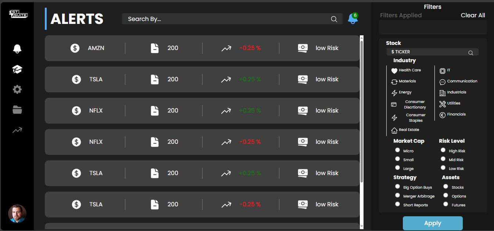
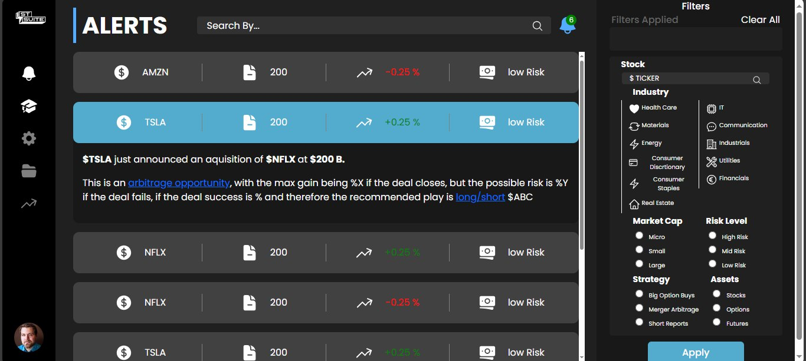
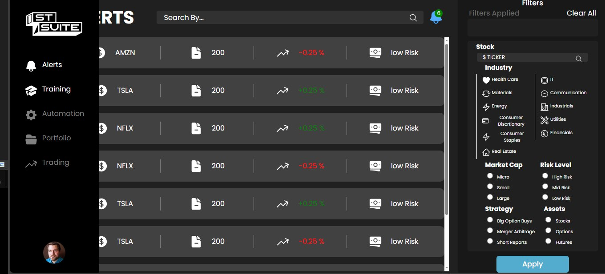

# St-Suite

## 📝 Table of Contents

- [About](#about)
- [Technologies used](#build)
- [getting started](#start)
- [screenshots](#screenshots)

### 🚩About<a name = "about"></a>

This is a simple UI for the stock price alerts.  


## 💻Technologies Used<a name = "build"></a>

- HTML
- CSS
- JS
- reactJS

## 🏁Getting Started <a name = "start"></a>


1. **_Clone the repository_**

```bash
git clone [https://github.com/Omaar2000/st-suite]

```

2. **_Go to the directory of the repository_**

```bash
cd <project_directory>

```

3. **_Run_**

go to https://st-suite.netlify.app/

## 🎥 screenshots<a name = "screenshots"></a>

- Preview                
  
  

  <hr />

- Expandable alert                           
  
  

  <hr />
- Hovering sidebar                           
  
  

  <hr />
